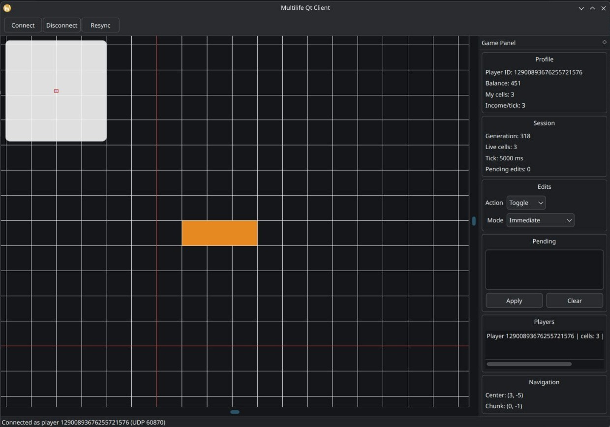

# multilife

[](https://github.com/pelmesh619/multilife/actions/workflows/tests.yml)

Multiplayer [Conway’s Game of Life](https://en.wikipedia.org/wiki/Conway%27s_Game_of_Life) is a game utilizing a C++20 server and a Qt 6 client that share one infinite, chunked world

Players place and remove cells, watch generations tick on the server, and see live updates while they pan and zoom the grid



**Features**:

* Infinite world split into 64x64 chunks
* Classic B3/S23 rules, stepped on a fixed server tick (default is 5s)
* Player-owned live cells and a simple resource economy (place costs 2, living cells pay 1 per tick, starting balance 10)
* TCP for handshake, commands, stats, and resync; UDP for chunk deltas and full snapshots
* Qt client: pan, zoom, owner colors, generation / balance / player list
* Immediate edits or a queued "apply" batch
* GoogleTest coverage on the server and Qt Test + GoogleTest on the client

## Architecture

```
Qt client  --TCP 9000-->  GameServer (Boost.Asio)
           <--UDP 9001--    ThreadPool + TickScheduler
                            World (chunks) + ResourceManager
```

Each tick the server exchanges chunk borders, computes the next generation in parallel, then applies player commands so edits show up immediately and affect the *next* generation. Missing UDP sequence numbers can be repaired with a TCP resync request.

The binary protocol is documented in [`server/include/Protocol.hpp`](server/include/Protocol.hpp) (`MLIF` magic, little-endian fields).

## Build

The server and client are separate CMake projects. Currently only Linux is supported

### Server

1. Install dependencies:

    * CMake 3.20+
    * a C++20 compiler
    * Boost 1.70+

    On Ubuntu/Debian:

    ```sh
    sudo apt-get install -y cmake ninja-build g++ libboost-dev
    ```

    On Fedora/CentOS:

    ```sh
    sudo dnf install -y cmake ninja-build g++ boost-devel
    ```

    On Arch:

    ```sh
    sudo pacman -S --needed cmake ninja boost
    ```

2. Build server:

    ```sh
    cmake -S server -B build/server -G Ninja -DCMAKE_BUILD_TYPE=Release
    cmake --build build/server
    ```

3. Run server:

    ```sh
    ./build/server/multilife-server
    ```

    The server listens on TCP port 9000** and UDP port 9001


### Client

1. Install dependencies:

    * CMake 3.20+
    * a C++20 compiler
    * Qt 6 (Widgets, Network)

    On Ubuntu/Debian:

    ```sh
    sudo apt-get install -y cmake ninja-build g++ qt6-base-dev
    ```

    On Fedora/CentOS:

    ```sh
    sudo dnf install -y cmake ninja-build g++ qt6-qtbase-devel
    ```

    On Arch:

    ```sh
    sudo pacman -S --needed cmake ninja qt6-base
    ```

2. Build client:

    ```sh
    cmake -S client -B build/client -G Ninja -DCMAKE_BUILD_TYPE=Release
    cmake --build build/client
    ```

3. Run client:

    ```sh
    ./build/client/multilife-qt-client
    ```

    The client opens a connect dialog (host, ports)

### Tests

Tests run with those commands:

```sh
ctest --test-dir build/server --output-on-failure
ctest --test-dir build/client --output-on-failure
```

Client UI tests use `QT_QPA_PLATFORM=offscreen`

## Known issues

* User-prompted player id could lead to impersonation of other players
* Server listening ports could not be changed unless rebuilding the executable
